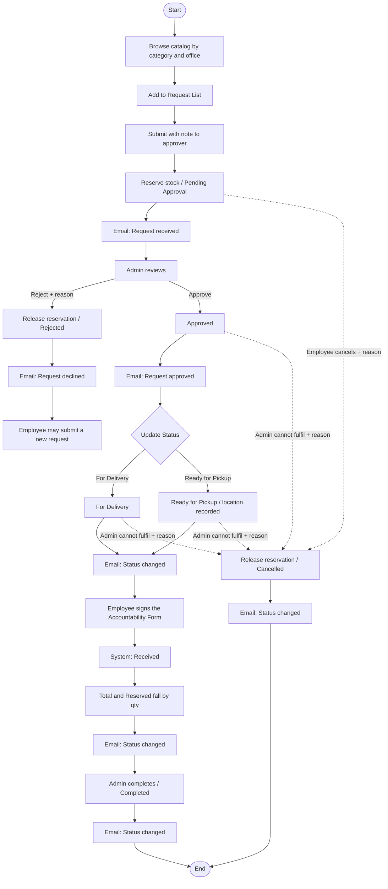

# Process Flow — Status, Stock and Notifications

Canonical status, stock and notification behavior.

**Baseline**: the 2026-09-22 `.fig` export. The 2026-09-11 process diagram is
historical: it drew three roles and a confirm-receipt step that the design no
longer has. Where this document departs from it, the departure is recorded in
[design-system/drift-2026-09-22.md](design-system/drift-2026-09-22.md) and
carried by [ADR-0005](adr/0005-two-role-model.md),
[ADR-0006](adr/0006-assets-and-inventory.md) and
[ADR-0007](adr/0007-fulfilment-status-vocabulary.md). Since 2026-09-26 stock is a
register of units ([drift-2026-09-26](design-system/drift-2026-09-26.md),
[ADR-0008](adr/0008-per-unit-inventory-register.md)). The numbers below are
counts of unit statuses and are unchanged. The same re-export added
`Received` ([drift-2026-09-26 §3](design-system/drift-2026-09-26.md),
[ADR-0009](adr/0009-received-and-accountability-form.md)).

**Purpose:** Clear path for requesting, approving and handing over office
supplies, including stock movements and notifications.

## Actors

| Actor | Job |
|-------|-----|
| **Employee** | Browses the catalog, builds a request list, submits, tracks their own requests, cancels their own request while it is `Pending Approval` |
| **Admin** | Reviews the queue, approves or rejects, sets `For Delivery` or `Ready for Pickup`, completes, cancels what cannot be fulfilled, owns Assets and Inventory |
| **System** | Moves stock, sends mail, records the notification log |

Two human roles, not three. See [ADR-0005](adr/0005-two-role-model.md).

## Swimlanes

### 1. Browse Catalog & Create Request (Employee)

1. Start
2. **Browse the catalog** — `Supply Catalog`, filtered by category chip and by
   **office**, each card showing a model select, an availability pill and a
   quantity stepper. `View specs >` opens the spec panel.
3. **Add to Request List** — the card's action; the top bar carries the count.
4. **Submit** — the Request List drawer holds the lines, a quantity stepper and
   **Remove** per line, and a free-text **Note to Approver (optional)**.
5. System: **reserve stock** — for each line, move the requested quantity from
   `Available` to `Reserved` at the requesting office; status becomes
   **Pending Approval**.
6. Confirmation: `REQ-…` · "Request submitted" · "Your request has been sent to
   your approver. We'll email you whenever its status changes."
7. Notification: **Request received** (to Employee).

### 2. Review (Admin)

The `Requests Queue` is one screen for the whole admin half: summary cards for
*Pending approval*, *In Processing* and *Low stock alerts*; filter chips
`All requests · Pending Approval · Approved · For Delivery · Ready for Pickup`;
search by request ID, employee name, email or item; sort by
*Newest First / Oldest First / Employee (A-Z)*. **Review** opens the request
panel.

The panel shows **REQUESTED BY** (avatar, name, `email • office`), the lines as
**ITEM / QTY / CURRENT INVENTORY**, the **Note to Approver**, and a status
timeline. Under the actions it states: *"The employee will receive an email with
your decision."*

1. Decision: Approve?
   - **No** → **Reject Request** → a dialog with **Reason for rejection \***
     (required) and **Confirm Rejection** → System **releases the reservation**
     (Reserved → Available); status **Rejected** → notification **Request
     declined** (to Employee) → the Employee may submit a **new** request.
   - **Yes** → **Approve Request** → status **Approved**; stock stays reserved
     → notification **Request approved** (to Employee).

### 3. Hand over (Admin)

1. **Update Status** on an approved request opens a `Status *` select.
2. Choose **For Delivery** or **Ready for Pickup**. These are peers, not a sequence.
   Choosing `Ready for Pickup` records a **pickup location**.
3. Notification: **Status changed** (to Employee), carrying *Previous status* →
   *New status*, and the **Pickup** location when there is one.
4. System: stock is still reserved; no quantity changes.
5. **Employee signs the Accountability Form** — the owning Employee, while the
   request is `For Delivery` or `Ready for Pickup`: ticks *I have read and agree
   to the above*, types their full name, optionally adds *Other Notes*, and
   presses **I acknowledge and sign**.
6. System: status **Received**. The reserved units become `Assigned` to the
   Employee, so `Total` and `Reserved` both fall by the requested quantity —
   this is when the items leave the store.
7. Notification: **Status changed** (to Employee) — the design's
   `Status changed email - Received`.
8. **Complete** (Admin) → status **Completed**, from `Received` only. No
   quantity changes.
9. Notification: **Status changed** (to Employee).

The Employee confirms receipt; the Admin closes the request. See
[ADR-0009](adr/0009-received-and-accountability-form.md), which amends
[ADR-0007](adr/0007-fulfilment-status-vocabulary.md) and
[ADR-0008](adr/0008-per-unit-inventory-register.md).

### 3b. Cancel (Employee or Admin)

A cancellation stops a request that has **not** been refused. It is not a
rejection: rejection is the Admin's decision on a request awaiting one.

1. **Employee cancels** — only their own request, and only while it is
   `Pending Approval`. The dialog asks for **Reason for cancellation \*** and is
   confirmed with **Confirm Cancellation**.
2. **Admin cancels** — an `Approved`, `For Delivery` or `Ready for Pickup` request
   that cannot be fulfilled. A reason is required.
3. A **reason is required from whoever cancels**.
4. A `Received` or `Completed` request cannot be cancelled; the items are
   already with the employee.
5. System: **release the reservation** (Reserved → Available); status
   **Cancelled**.
6. Notification: **Status changed** (to Employee; to the Admin queue when the
   Employee cancelled).
7. `Cancelled` is terminal. The employee submits a **new** request if they still
   need the items.

### 4. History (Admin)

`History` is the audit trail — "Full audit trail — completed, cancelled, and
rejected requests" — across all requestors, with chips
`All requests · Completed · Cancelled · Rejected` and columns
REQUEST ID · REQUESTER · ITEMS · STATUS · RESOLVED · ACTION. **Review** opens a
read-only panel that shows the stored **Reason for rejection** or **Reason for
cancellation** and a **Close** button.

## Status Values

| Status | Set by | Set when | Total | Available | Reserved |
|--------|--------|----------|-------|-----------|----------|
| `Pending Approval` | Employee | submit | — | −qty | +qty |
| `Rejected` | Admin | reject, reason required | — | +qty | −qty |
| `Approved` | Admin | approve | — | — | — |
| `For Delivery` | Admin | update status | — | — | — |
| `Ready for Pickup` | Admin | update status, location recorded | — | — | — |
| `Received` | System | the owning Employee submits the Accountability Form, from `For Delivery` or `Ready for Pickup` | −qty | — | −qty |
| `Completed` | Admin | complete, from `Received` only | — | — | — |
| `Cancelled` | Employee or Admin | cancel, reason required | — | +qty | −qty |

`For Delivery` and `Ready for Pickup` are alternatives, not stages.
`Rejected`, `Cancelled` and `Completed` are terminal.

`For Release` and `Released` are **retired**. The Employee's confirm-receipt
step, retired by ADR-0007, returns as the Accountability Form
([ADR-0009](adr/0009-received-and-accountability-form.md)).

## Stock Rules

1. An **Asset** must exist and hold stock before it can be requested. Stock is
   **units**: one per physical item, added by an Admin one at a time or in bulk
   (`+ Add Inventory` → Add Single Unit / Add Multiple Units).
2. Each unit is held at one office — Cebu, Bacolod, Makati, Ortigas, Davao —
   and has a status: `Available`, `Reserved`, `Assigned` or `Inactive`. Per
   **(asset, office)**, **Available** and **Reserved** count the units in those
   statuses, and **Total** = Available + Reserved (the units still in the store).
3. `Total = Available + Reserved` at all times. None of the three may be
   negative.
4. **Submit reserves**: the requested number of units move Available → Reserved,
   in the same transaction as the status change to `Pending Approval`. The API
   chooses which units.
5. **Reject and cancel release**: those units move Reserved → Available, in the
   same transaction as the status change.
6. **Approve, For Delivery, Ready for Pickup and Complete change nothing.** The
   units are already reserved, or already assigned.
7. **Received assigns**: the reserved units become `Assigned` to the Employee,
   so Total and Reserved both fall, in the same transaction as the status change
   to `Received`. The Assets screen counts them as *Assigned units* (formerly
   *Deployed units*), and the Employee's Profile lists them under
   *Currently Assigned*.
8. A line quantity must not exceed `Available` at the requesting office at
   submit time. Concurrent submits for the last unit must serialize so
   `Available` never goes negative.
9. Each asset carries one **Low-stock threshold** (per asset, not per office),
   which drives the `In Stock` / `Low Stock` / `Out of Stock` pill and the chip
   counts against Available in the scope on screen.
10. Only request transitions move a unit into or out of `Reserved`. An Admin
    editing a unit may set `Available` ↔ `Inactive`, or record an existing
    assignment (`Assigned` + user) for equipment handed out outside a request.
    A unit that is `Assigned` or `Reserved` cannot be removed. A unit's BitLocker
    identifier and recovery key/PIN are Admin-only secrets.

> ~~`Ortigas` vs the published `CreateAssetDto`'s `Pasig`.~~ **Closed
> 2026-09-25**: every contract `location` enum says `Ortigas`.

## Notification Catalog

Four transactional templates cover every transition, plus two the design draws
that are not transitions. All share a 600px card: logo header with
`REQUEST MANAGEMENT`, semantic icon, eyebrow, headline, message copy, an
optional **Current status** row carrying a real status pill, a detail table, a
primary action, support copy, footer.

### 1. Request received

- **When:** submit
- **To:** Employee
- **Eyebrow / Headline:** Request received — "We've received your equipment request"
- **Body:** "Hi [Name] - your request has been submitted successfully. The Workplace team will review it and notify you when the status changes."
- **Current status:** `Pending Approval`
- **Details:** Request · Request ID · Submitted · Owner
- **Action:** View request
- **Support:** "Typical review time is 1-2 business days. You can add a comment or attachment from the request page."

### 2. Request approved

- **When:** approve
- **To:** Employee
- **Eyebrow / Headline:** Request approved — "Your equipment request is approved"
- **Body:** "Good news, [Name] - [Approver] approved your [request] request. Procurement can now begin fulfillment."
- **Current status:** `Approved`
- **Details:** Request · Request ID · Approved by · Approved
- **Action:** View approval
- **Support:** "We'll notify you again when fulfillment begins. No action is needed from you right now."

### 3. Request declined

- **When:** reject
- **To:** Employee
- **Eyebrow / Headline:** Request declined — "Your equipment request wasn't approved"
- **Body:** "Hi [Name] - [Admin] declined this request because [reason]."
- **Current status:** `Rejected`
- **Details:** Request · Request ID · Decision by · **Reason**
- **Action:** Review decision
- **Support:** "Have additional context? Add a comment to the request or contact Workplace Operations for guidance."

### 4. Status changed

The template for **every other transition** — `For Delivery`, `Ready for Pickup`,
`Received`, `Completed`, `Cancelled`. The design draws a variant for `Received`,
*"Equipment Delivered/Claimed"* (`Status changed email - Received`).

- **When:** any transition not covered by 1–3
- **To:** Employee (and the Admin queue when the Employee cancelled)
- **Eyebrow:** Status update
- **Headline:** states the new status, e.g. "Your request is ready for pickup"
- **Body:** "Hi [Name] - the Workplace team changed the status of your [request] request from [previous] to [new]."
- **Details:** Request · Request ID · **Previous status** · **New status** · **Pickup** (when `Ready for Pickup`)
- **Action:** View request
- **Support:** e.g. "Bring your employee badge when you collect the device. Pickup hours are Monday-Friday, 9 AM-5 PM."

### 5. Welcome — not a transition

- **When:** account created
- **To:** the new user
- **Headline:** "Your portal is ready"
- **Action:** Open your workspace

### 6. Action required — designed, not buildable yet

- **Headline:** "More information is needed"
- **Details:** Request · Request ID · **Requested detail** · **Respond by**
- **Action:** Provide information

> No screen lets a reviewer raise a request for information or set a respond-by
> date, and no status covers it. **Out of scope for the MVP** and flagged to the
> designer — see [drift-2026-09-22 §5](design-system/drift-2026-09-22.md).

> The 2026-09-15 amendment invented a "Request Cancelled" email because the file
> defined the status and no mail. That copy is **withdrawn**: cancellation now
> sends **Status changed**, which the file does define.

## Mermaid

