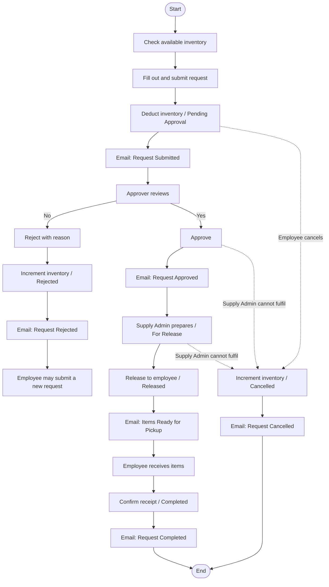

# Process Flow — Inventory and Notifications

Transcribed from the Office Supplies Request System process diagram. This is the canonical status, inventory, and notification behavior.

**Purpose:** Clear path for requesting, approving, and releasing office supplies, including inventory updates and notifications.

## Swimlanes

### 1. Check Inventory & Create Request (Employee)

1. Start
2. **Check Available Inventory** — view current stock number per item
3. **Fill Out Request** — select items, enter quantity, optional purpose, submit
4. System: **Deduct inventory**; status becomes **Pending Approval**
5. Notification: **Request Submitted** (to Employee)

### 2. Review & Approve (Approver)

1. **Review Request** — check items, verify inventory and necessity
2. Decision: Approve?
   - **No** → **Reject Request (with reason)** → System **increments inventory**; status **Rejected** → notification **Request Rejected** (to Employee) → Employee may submit a **new** request
   - **Yes** → **Approve Request** → notification **Request Approved** (to Employee and Supply Admin) → inventory stays deducted

### 3. Prepare & Release (Supply Admin)

1. **Prepare Items** — check inventory, pick and pack, status **For Release**
2. **Release Items to Employee** — hand over, status **Released**
3. Notification: **Items Ready for Pickup / Released** (to Employee)
4. System: inventory already deducted; no further qty change

### 3b. Cancel (Employee or Supply Admin)

A cancellation stops a request that has **not** been refused. It is not a
rejection: rejection is the Approver's decision on a request awaiting one.

1. **Employee cancels** — only their own request, and only while it is `Pending Approval`, i.e. before anyone has decided. A reason is optional.
2. **Supply Admin cancels** — an `Approved` or `For Release` request that cannot be fulfilled (item unavailable, no longer needed). A reason is **required**.
3. A `Released` request cannot be cancelled; the items are already with the employee.
4. System: **increment inventory**; status **Cancelled**.
5. Notification: **Request Cancelled** (to Employee and Approver; also to the Supply Admin when the request had reached them).
6. `Cancelled` is terminal. The employee submits a **new** request if they still need the items.

### 4. Complete (Employee)

1. **Receive Items**
2. **Confirm Receipt in System** → status **Completed**
3. Notification: **Request Completed** (to Employee and Approver)
4. System: no inventory change

## Status Values

| Status | Set when | Inventory |
|--------|----------|-----------|
| `Pending Approval` | Employee submits | Decremented |
| `Rejected` | Approver rejects with reason | Incremented back |
| `Approved` | Approver approves | Already deducted |
| `For Release` | Supply Admin finishes prepare | Already deducted |
| `Released` | Supply Admin hands over | Already deducted |
| `Completed` | Employee confirms receipt | No change |
| `Cancelled` | Employee cancels their own `Pending Approval` request, or a Supply Admin cancels an `Approved` or `For Release` one | Incremented back |

## Inventory Rules

1. Inventory MUST be encoded in the system before requests can be submitted.
2. When a request is submitted, on-hand quantity is decremented by the requested quantity (`Pending Approval`).
3. When a request is rejected, on-hand quantity is incremented by the requested quantity (`Rejected`).
4. When a request is approved and items are released, quantity stays decremented (`Released` / `Completed`).
5. When a request is cancelled, on-hand quantity is incremented by the requested quantity (`Cancelled`), in the same transaction as the status change. The stock was deducted at submit and the items are not leaving the store, so it goes back — exactly as it does on rejection.

## Notification Catalog

### 1. Request Submitted

- **When:** Submit
- **To:** Employee
- **Subject:** Office Supplies Request Submitted
- **Body pattern:** Hi [Name]. Your office supplies request has been submitted. Request ID: #[id]. Items / Quantity. Current inventory has been updated.

### 2. Request Approved

- **When:** Approve
- **To:** Employee and Supply Admin
- **Subject:** Office Supplies Request Approved
- **Body pattern:** Request #[id] has been approved. The supply team will now prepare your items. Items / Quantity. Inventory remains deducted.

### 3. Request Rejected

- **When:** Reject
- **To:** Employee
- **Subject:** Office Supplies Request Rejected
- **Body pattern:** Request #[id] has been rejected. Reason: [reason]. Inventory has been returned. You may submit a new request if needed.

### 4. Items Ready for Pickup / Released

- **When:** Release
- **To:** Employee
- **Subject:** Office Supplies Ready for Pickup
- **Body pattern:** Items are ready for pickup at [Location] / have been released. Items / Quantity. Please collect them at your earliest convenience.

### 5. Request Completed

- **When:** Confirm receipt
- **To:** Employee and Approver
- **Subject:** Office Supplies Request Completed
- **Body pattern:** Request #[id] has been completed.

### 6. Request Cancelled

- **When:** Cancel
- **To:** Employee and Approver (and the Supply Admin when the request had reached them)
- **Subject:** Office Supplies Request Cancelled
- **Body pattern:** Request #[id] has been cancelled by [Name]. Reason: [reason, when one was given]. Inventory has been returned. You may submit a new request if needed.

> **Invented copy.** The design file defines the `Cancelled` status but no
> cancellation email. Subject and body follow the five the file does define, and
> are flagged for the designer in
> [design-system/drift-2026-09-15.md](design-system/drift-2026-09-15.md).

## Mermaid (happy path, reject, cancel)

